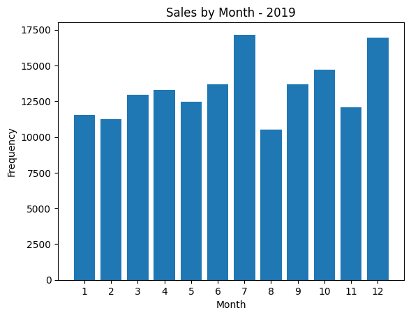

# 🏠 Dashboard Immobilier DVF

Un dashboard **Streamlit** interactif pour explorer les transactions immobilières en France à partir des données ouvertes **DVF** (*Demandes de Valeurs Foncières*, publiées par l'État). Filtrez par région, département, type de bien, visualisez les prix au m², et localisez les transactions sur carte.

Projet Master 1 — Data Visualization, Efrei Paris.



## ✨ Fonctionnalités

| Page | Description |
|---|---|
| 🏠 **Accueil** | Présentation du projet |
| 📊 **Visualisations générales** | Fréquence des mutations, tendance mensuelle, répartition par type de bien, prix moyen par département/région, carte des transactions — pour 2019 ou 2020 |
| 🔎 **Votre exploration** | Filtres interactifs (type de mutation, type de bien, région/département, nb. de pièces), nuage de points prix/surface, carte vue d'ensemble ou détaillée |
| 🧠 **Estimation / Prédiction** | Estimation du prix de vente d'une maison ou d'un appartement (type de bien, surface, nb. de pièces, département) via un modèle Random Forest entraîné sur les ventes 2019 |

## 📂 Structure du projet

```
project_st.py         # application Streamlit
project.ipynb          # notebook d'exploration et de nettoyage (données 2019)
dvf_test.ipynb         # notebook de test (imputation KNN)
data/
  └── departements-france.csv   # table de référence département/région (incluse)
```

## 📥 Données

Les jeux de données de transactions sont trop volumineux pour être versionnés ici. Télécharge-les depuis [data.gouv.fr — Demandes de valeurs foncières](https://www.data.gouv.fr/fr/datasets/demandes-de-valeurs-foncieres/) et place-les dans `data/` :

- `data/full_2019.csv` — jeu de données DVF complet 2019
- `data/sampled_2020_by_dep.csv` — données DVF 2020, échantillonnées par département

## 🚀 Lancer le projet

```bash
pip install -r requirements.txt
streamlit run project_st.py
```
